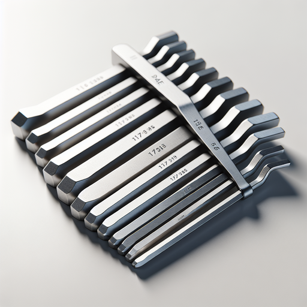

# SAE Hex Key Set - HTAK000019

## Product Overview

The SAE Hex Key Set (Model: HTAK000019) is a comprehensive collection of precision hex keys designed for various mechanical applications. This set provides standard SAE (Society of Automotive Engineers) sized hex keys for professional and DIY use.

## Features

- **Complete SAE Sizing**: Includes all standard SAE hex key sizes
- **Durable Construction**: Made from high-quality hardened steel
- **Precision Machined**: Ensures accurate fit and reduced wear
- **Organized Storage**: Comes with convenient storage holder
- **Corrosion Resistant**: Chrome finish for long-lasting durability

## Specifications

- **Material**: Hardened Chrome Vanadium Steel
- **Finish**: Chrome plated
- **Standard**: SAE (Imperial) measurements
- **Tolerance**: ±0.001"

## Included Sizes

The set typically includes the following SAE hex key sizes:
- 1/16"
- 5/64"
- 3/32"
- 7/64"
- 1/8"
- 9/64"
- 5/32"
- 3/16"
- 7/32"
- 1/4"
- 5/16"
- 3/8"

## Usage Instructions

### Basic Operation
1. Select the appropriate size hex key for your application
2. Insert the hex key fully into the socket or screw head
3. Turn clockwise to tighten, counterclockwise to loosen
4. Apply steady pressure to prevent stripping

### Best Practices
- Always use the correct size to prevent damage
- Keep hex keys clean and dry
- Store in the provided holder to prevent loss
- Inspect for wear or damage before use

## Maintenance

### Cleaning
- Wipe clean with a dry cloth after use
- For stubborn dirt, use mild soap and water
- Dry thoroughly to prevent corrosion

### Storage
- Store in a dry environment
- Use the provided holder or organizer
- Keep away from corrosive chemicals

## Safety Warnings

⚠️ **Important Safety Information**
- Always wear safety glasses when using tools
- Ensure proper fit before applying force
- Do not use damaged or worn hex keys
- Keep tools away from children

## Troubleshooting

| Problem | Cause | Solution |
|---------|-------|----------|
| Hex key slips | Wrong size or worn key | Use correct size or replace key |
| Difficulty inserting | Debris in socket | Clean socket thoroughly |
| Key feels loose | Worn hex key or socket | Replace worn components |

## Applications

This hex key set is ideal for:
- Automotive maintenance
- Bicycle repairs
- Furniture assembly
- Electronic equipment
- Machinery maintenance
- General mechanical work

## Warranty

This product is covered under standard manufacturer warranty. Contact customer service for warranty claims or technical support.

---

**Model**: HTAK000019  
**Product Type**: SAE Hex Key Set  
**Category**: Hand Tools
