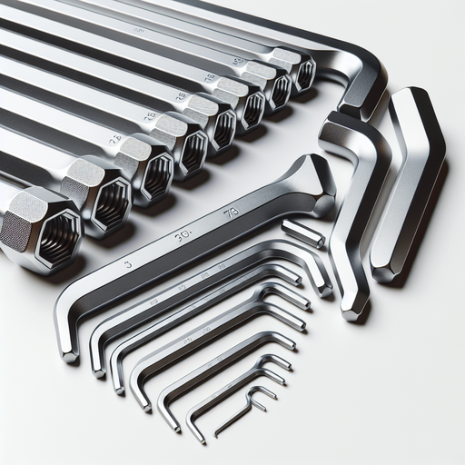

# Ball-End Hex Set - HTAK000020

## Product Overview

The Ball-End Hex Set (Model: HTAK000020) features innovative ball-end design that allows for angled access to hard-to-reach fasteners. This professional-grade tool set is essential for automotive, mechanical, and assembly applications where standard hex keys cannot reach.

## Features

- **Ball-End Design**: Allows up to 25° angle access
- **Dual Functionality**: Ball end for angled access, standard end for maximum torque
- **Complete Size Range**: Comprehensive metric and SAE sizes
- **High-Quality Steel**: Chrome vanadium construction for durability
- **Convenient Storage**: Organized holder keeps tools accessible

## Specifications

- **Material**: Chrome Vanadium Steel
- **Finish**: Satin Chrome
- **Design**: Ball-end with standard end
- **Angle Access**: Up to 25 degrees
- **Tolerance**: ±0.05mm

## Included Sizes

### Metric Sizes
- 1.5mm
- 2mm
- 2.5mm
- 3mm
- 4mm
- 5mm
- 6mm
- 8mm
- 10mm

### SAE Sizes
- 1/16"
- 5/64"
- 3/32"
- 1/8"
- 5/32"
- 3/16"
- 1/4"
- 5/16"

## Usage Instructions

### Ball-End Operation
1. Use ball end for accessing angled or recessed fasteners
2. Insert at up to 25° angle for hard-to-reach areas
3. Apply moderate pressure - ball end provides less torque than standard end

### Standard End Operation
1. Use standard end for maximum torque application
2. Insert fully into fastener for best grip
3. Apply full torque when needed for tight fasteners

### Switching Between Ends
- Ball end: Better for accessibility and speed
- Standard end: Better for high-torque applications

## Applications

Perfect for:
- Automotive engine work
- Tight space assembly
- Electronic equipment maintenance
- Bicycle brake and derailleur adjustments
- Furniture with recessed bolts
- Machinery maintenance in confined areas

## Advantages of Ball-End Design

### Access Benefits
- Reach angled fasteners easily
- Work in confined spaces
- Reduce need for removal of surrounding components
- Speed up assembly and disassembly processes

### Efficiency Gains
- Continuous contact during turning
- Reduced tool changes
- Less repositioning required
- Faster overall job completion

## Maintenance

### Care Instructions
- Clean after each use to remove debris
- Store in protective holder
- Inspect ball ends for wear or damage
- Replace if ball end becomes significantly worn

### Lubrication
- Light oil application on pivot points
- Wipe excess to prevent dirt accumulation
- Avoid over-lubrication which attracts debris

## Safety Guidelines

⚠️ **Safety Precautions**
- Use appropriate eye protection
- Ensure secure grip before applying force
- Check ball-end condition before use
- Do not exceed recommended angle limits
- Be aware of reduced torque capacity at angles

## Troubleshooting

| Issue | Possible Cause | Solution |
|-------|---------------|----------|
| Ball end slips | Worn ball or wrong size | Replace tool or verify size |
| Insufficient torque | Using ball end for high torque | Switch to standard end |
| Tool won't fit | Incorrect size selection | Verify fastener size |
| Ball end damaged | Excessive force or dropping | Replace hex key |

## Technical Notes

### Torque Limitations
- Ball end: Approximately 70% of standard end torque
- Angle affects available torque
- Maximum recommended angle: 25°

### Material Properties
- Hardness: 58-62 HRC
- Tensile strength: High-grade steel specification
- Corrosion resistance: Chrome plating protection

## Storage and Organization

- Use provided holder for organization
- Keep in dry environment
- Arrange by size for quick selection
- Protect ball ends from impact damage

---

**Model**: HTAK000020  
**Product Type**: Ball-End Hex Set  
**Category**: Precision Hand Tools  
**Special Feature**: 25° Angle Access
