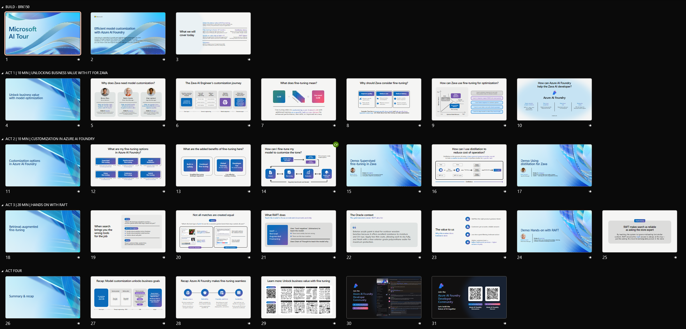

# Act 1: Unlock Business Value

This section covers the second row of slides in the deck below. This section does NOT require any prior setup. Use this simply to set the stage for the demos. Key messages:

1. Unlocking business value requires customization to task or domain
1. Model customization journey = prompt engineering to RAG to fine tuning
1. Fine tuning is critical = to go last-mile in accuracy, cost & perf targets
1. Azure AI Foundry makes it seamless = faster models, easier flows, dev tier!
1. Lets take Azure AI Foundry for a spin = Act 2!

