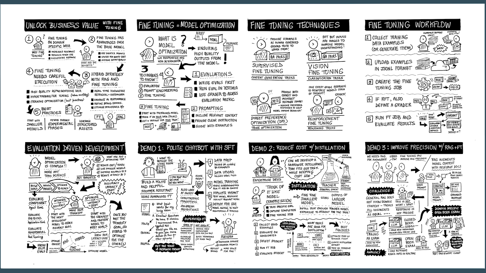

# How to deliver this session

_Thank you for delivering this session on the Microsoft AI Tour!_

## 1. Before You Begin

Take these actions to familiarize yourself with the content!

| | |
|:---|:---| 
| READ | This document! It is your instruction guide. |
| DOWNLOAD | The Session Delivery Deck linked below! |
| WATCH | The Session Recording for delivery tips .. |
| CUSTOMIZE | The Downloaded Deck to fit your presentation style |
| ASK | The Content Leads listed for any clarifications!  |
| | |

## 2. Prepare Demos Early

This session focuses on Fine-Tuning for model customization. This is not a technique you can demo "live" given it requires an hour or more for even the simplest demo.

Instead, we recommend the "Cooking demo" approach:

1. Setup the demo **a day in advance**. Check that FT jobs completed.
1. Keep the demo staged on your laptop during your session.
1. Play the pre-recorded demo video during the talk itself.
1. Switch to staged demo only to show final outcome or answer questions.

## 3. Your Session Resources - `TO-FIX`  🚧

| Resources          | Links                            | Description |
|-------------------|----------------------------------|-------------------|
| Session Delivery Deck   |  [Deck-TBD](https://aka.ms/) |  The Powerpoint slides for this breakout.|
| Session Delivery Recording | [Video-TBD](https://aka.ms/) | Recorded version of talk with tips for delivery.  |
| Demo Setup Guide |[Demo-TBD](https://aka.ms/)  | Guide to setting up and reproducing demos yourself if necessary. (We provide pre-recorded videos) |
| | |

## 4. Session Pacing

The figure below shows a high-level view of the speaker deck sections. This is a 45-minute session with three demos that will take up most of the time, so pace yourself accordingly. **When necessary, prioritize demo time over slides**.

The talk is structured as four acts. Here is how we suggest you allocate time:

- **Row 1** - _Welcome_: Introduction & Agenda (1 min)
- **Row 2** - _Act 1_: Unlock Business Value with Fine Tuning (10 min)
- **Row 3** - _Act 2_: Fine Tuning In Azure AI Foundry (Demo) (10 min)
- **Row 4** - _Act 3_: Retrieval Augmented Fine Tuning (Demo) (10 min)
- **Row 5** - _Wrap-up_: Take-away Messages & CTAs (4 min)

The table below gives a slighly more detailed breakdown - this is a recommended flow but please feel free to reduce time spent on slides _and focus more time on the demos_. 

| Row | Time | Description | Slides |
|:---|:---|:---|:---|
| 1 | 1 min | Welcome attendees · Introduce yourself and session topic | 3-4 |
| 2 | 10 min  | Introduce Zava Scenario · Explain their model customization journey · How can Azure AI Foundry help Zava? | 5-11 |
| 3 | 2 min  | Introduce fine-tuning options on Azure · Explain platform benefits | 12-15 |
|  | 4 min  | How Basic Fine Tuning Works · Let's See The Demo  | 14, Play Recording |
|  | 4 min  | How Distillation Works · Let's See The Demo  | 16, Play Recording |
| 4 | 5 min  | What is Retrieval-Augemented Fine Tuning? | 18-23 |
|   | 15 min  | How RAFT Works · Let's See The Demo  | 24-25, Play Recording |
| 5 | 5 min | 2 Takeaway Messages · Recap Visual · Venue CTA (TBA) | 27-30 |
| | | 

You will not have time for Q&A during the session given the content - instead, we recommend you ask listeners to come speak to you after the session. This also gives you time to show relevant outcomes or answer questions _using the staged version of the demo on your laptop_ for more realistic interactions.

## 5. Session Storyboard (Narrative)

The sketchnote provided below is embedded as the last slide of the deck along. _Encourage attendees to take a picture when you show that slide_ - it lets them take away both a visual recap and QR codes that point to a whitepaper (for decision-makers) and to this repo (for developers), to improve recall.

The storyboard itself serves as a conversational narrative that can give you some background context if you are new to this topic. You do not need to use this in your delivery, but we hope it gives you a sense for the key questions that developers have, and how we address them.

| Tile | Question | Description |
|:---|:---|:---|
| 1 | How do I unlock business value? | With fine-tuning you can customize models with task- or domain- specific data to improve model performance on your task!|
| 2 | How do I get started on customization?  | Start with a base model. Try prompt engineering and RAG to optimize model context. Then use fine-tuning to adapt behavior for improved cost, latency and accuracy! |
| 3 | What fine-tuning technique should I use? | It depends on the model, the task, and the target metric to optimize! Use SFT for content generation tasks, RFT for reasoning tasks, Vision Tuning for image classification or entity extraction tasks, and Distillation for model compression objectives. |
| 4 | What does a fine-tuning process involve? | It starts with dataset curation (in JSONL format). Upload the data, configure hyperparameters, and start the fine-tuning job. Once completed, evaluate the fine-tuned variant to assess if your performance targets have improved - else iterate. |
| 5 | What is evaluation-driven development? | It's like test-driven development but for AI applications. Start by defining evaluators to assess metrics, then set goals (pass/fail or other) before you begin optimization. Run evaluations on every iteration to verify improvements - till you meet your goals.|
| 6 | How can I customize model tone and style? | Start with a basic technique like Supervised Fine Tuning (SFT) where you train it on examples that _show_ (not tell) the desired behavior with Q&A pairs in JSONL format.|
| 7 | How can I reduce model operating costs? | If your target task can be achieved with _narrower intelligence_ then distillation helps! Use your current LLM as a "teacher" to train a smaller, cheaper model to do that one task well! |
| 8 | How can I improve precision for RAG?| Fine-tuning cannot _add_ data to the model, but it can _refine_ behaviors that work with that data. With techniques like RAFT, you can teach the model how to _select_ better context (given both relevant and distractor documents) - thereby improving _precision_ in responses. |
|  | | |

## 6. Session Demo (Setup) - `TO-FIX`  🚧

_TBD_ - provide guidance on how to setup demos, or point to where this is described.
