### Efficient Model Customization with Azure AI Foundry

Speaker 1
Speaker 2

AI Tour 2025

<!--
_speaker_notes: Slide 1

Welcome to AI Tour.
My name is XXX (introduce yourself)

-->

---

<!--
_speaker_notes: Slide 2

Today we'll talk about how Azure AI Foundry can help you customize those base models to meet your cost, quality and performance needs!

-->

---

<!--
_speaker_notes: Slide 3

Let's set the stage with a real-world application to understand how we can unlock business value. Then, we'll see hands-on demos of techniques - before wrapping up with key resources.

-->

---

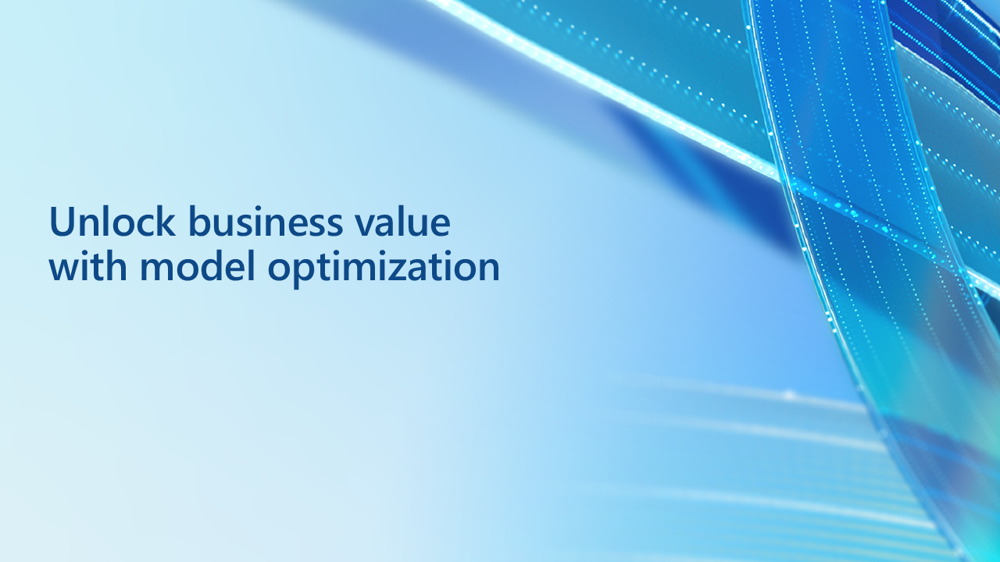

<!--
_speaker_notes: Slide 4

(These slides are there just as cues to the audience that we are entering a new stage - you don't need to say anything..)

-->

---

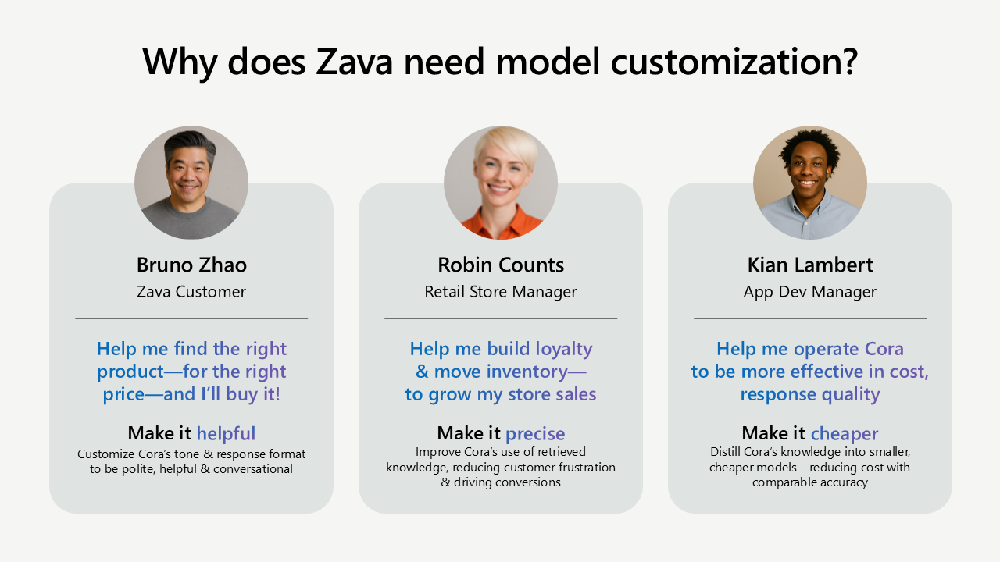

<!--
_speaker_notes:

Zava is an enterprise DIY good retailer. 
Cora is their AI chatbot for unlocking business value.

Customers like Bruno - want Cora to be helpful in their search.

Store Managers like Robin - want Cora to be precise to drive customer loyalty & sales.

App Dev Managers like Kian - want Cora to be cost-effective without sacrificing quality

-->

---

<!--

Like everyone, Zava AI engineers start with a base model, then prompt engineer it (to get Cora's tone and style), then add RAG (to get Cora's responses grounded in Zava product catalogs)

But their prompt length is growing, their operating costs are escalating, and the RAG-driven responses are grounded .. but not exactly precise.

ITS TIME TO EXPLORE FINE TUNING FOR OPTIMIZATION

-->

---

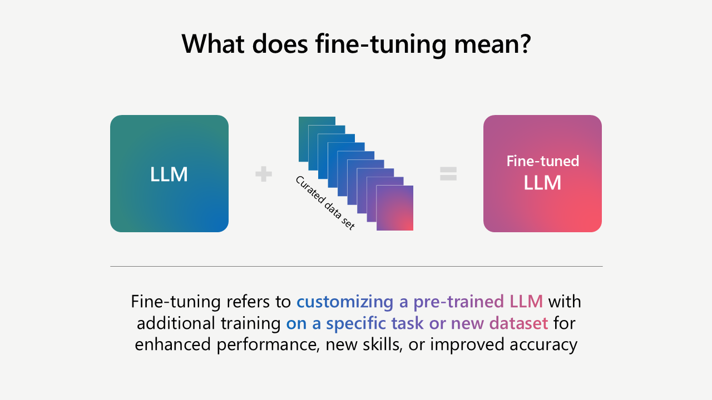

<!--
_speaker_notes:

Fine tuning is about re-training the base model with new data examples that is TASK-SPECIFIC or DOMAIN-SPECIFIC 

It does not "add" knowledge to the model. Rather, it uses examples to "teach" behaviors (e.g., "Answer politely") that improve the performance of that model FOR THAT TASK OR DOMAIN.

-->

---
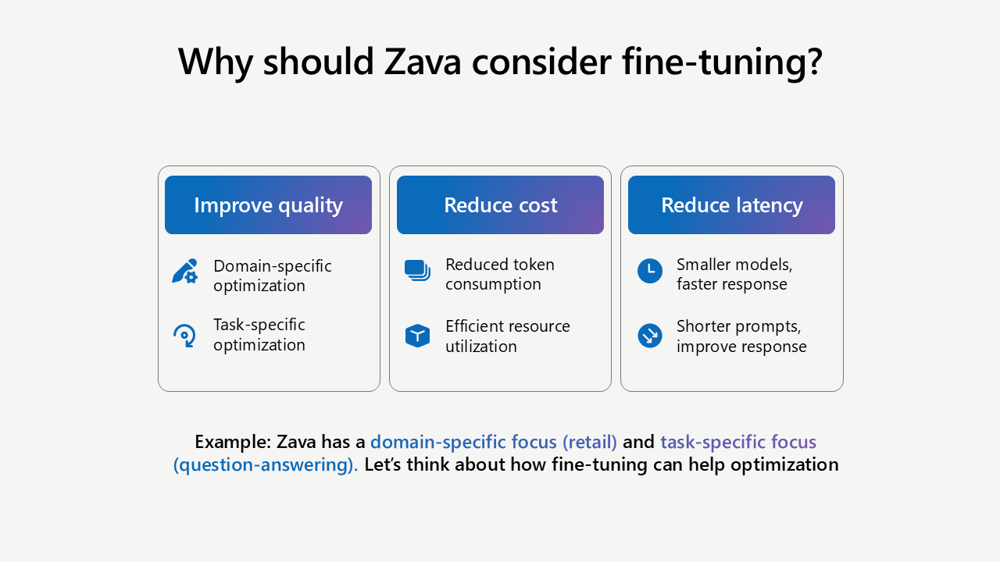
<!--
_speaker_notes:

By fine-tuning models, Zava can

1. Improve quality - by tailoring responses to retail needs
1. Reduce cost - by using shorter prompts
1. Improve performance - by using smaller, faster models

-->

---
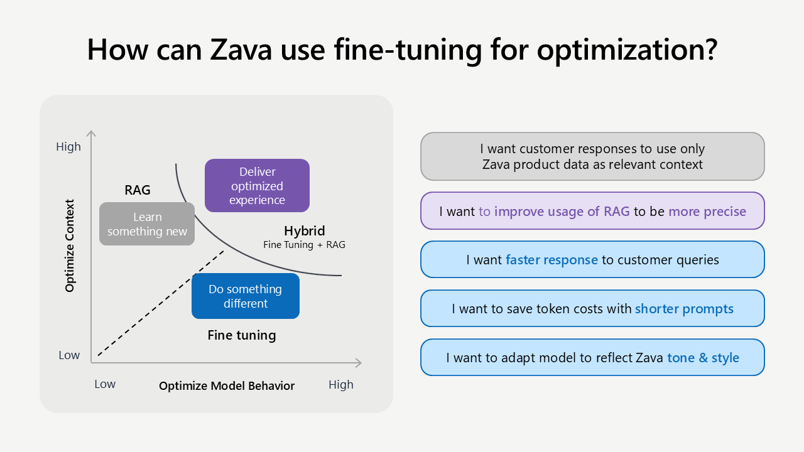
<!--
_speaker_notes:

How can Zava do this? Think of optimization along two axes:

- Optimize Context with RAG
- Optimize Behavior with Fine-Tuning
- Or do ... Both with Hybrid Fine-Tuning

We can see how our use cases map to these segments - but wouldn't it be really complex and costly to build these scenarios?

-->

---

<!--
_speaker_notes:

This is where Azure AI Foundry can help!! With the latest updates, you have faster models, easier workflows and features like Developer Tier that help you test fine-tuned models without hosting fees - just the cost of inference!

Let's take a closer look!

-->

---

<!--
_speaker_notes:
- 
-->

---
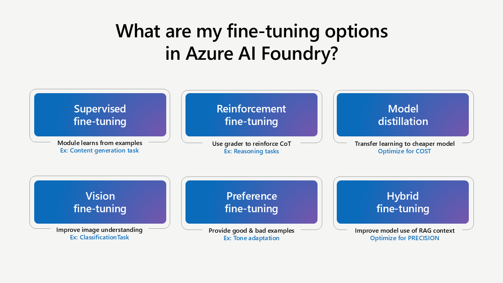
<!--
_speaker_notes:
- 
-->

---
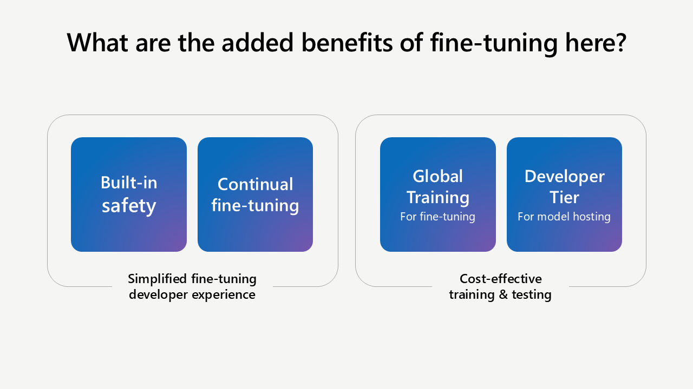
<!--
_speaker_notes:
- 
-->

---

<!--
_speaker_notes:
- 
-->

---

<!--
_speaker_notes:
- 
-->

---
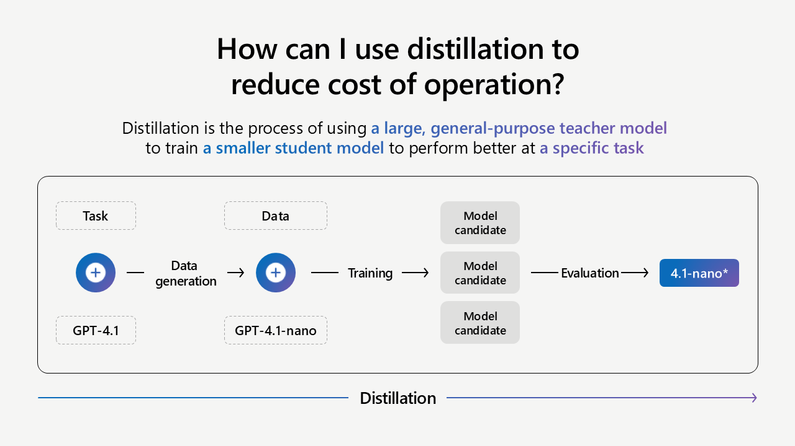
<!--
_speaker_notes:
- 
-->

---

<!--
_speaker_notes:
- 
-->

---

<!--
_speaker_notes:
- 
-->

---
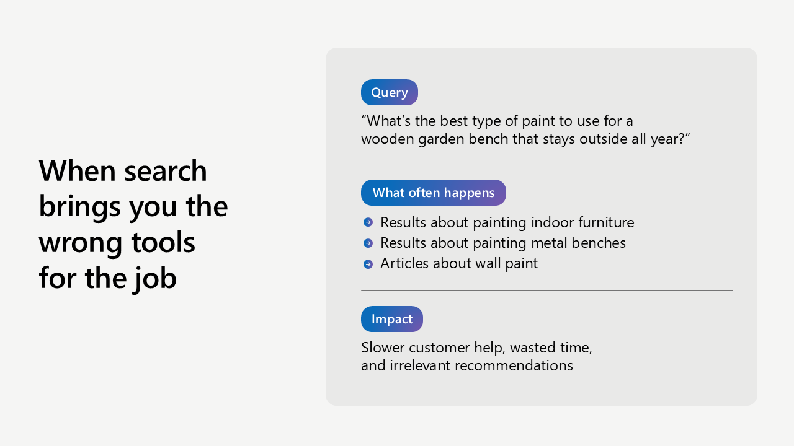
<!--
_speaker_notes:
- 
-->

---
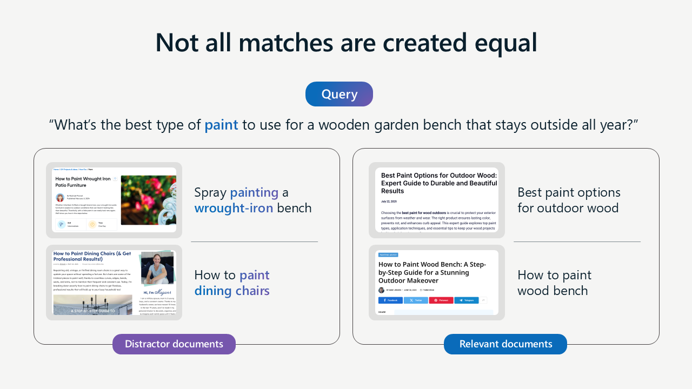
<!--
_speaker_notes:
- 
-->

---
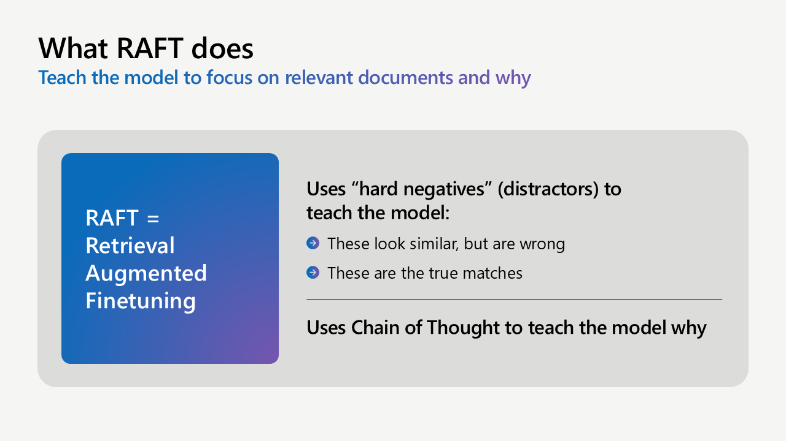
<!--
_speaker_notes:
- 
-->

---

<!--
_speaker_notes:
- 
-->

---
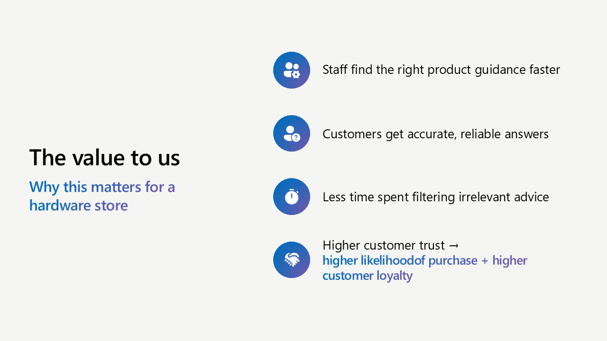
<!--
_speaker_notes:
- 
-->

---

<!--
_speaker_notes:
- 
-->

---

<!--
_speaker_notes:
- 
-->

---

<!--
_speaker_notes:
- 
-->

---

<!--
_speaker_notes:
- 
-->

---

<!--
_speaker_notes:
- 
-->

---

<!--
_speaker_notes:
- 
-->

---
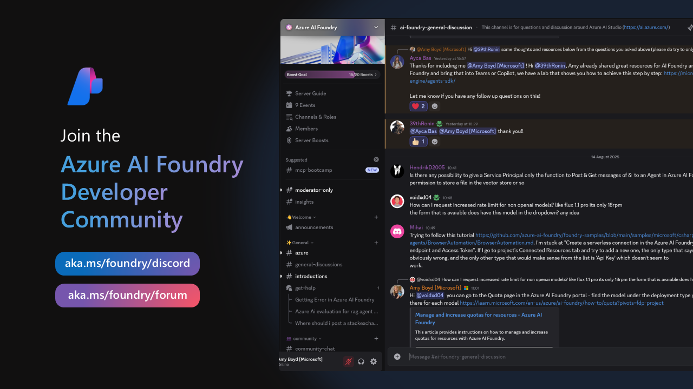
<!--
_speaker_notes:
- 
-->

---
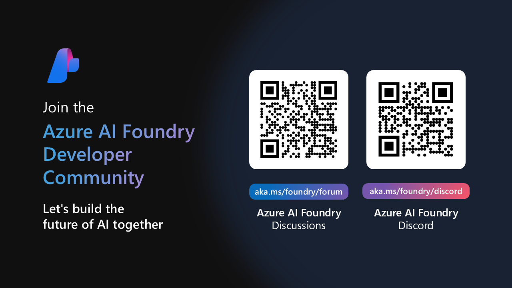
<!--
_speaker_notes:
- 
-->

<!-- Add more slides as needed -->
