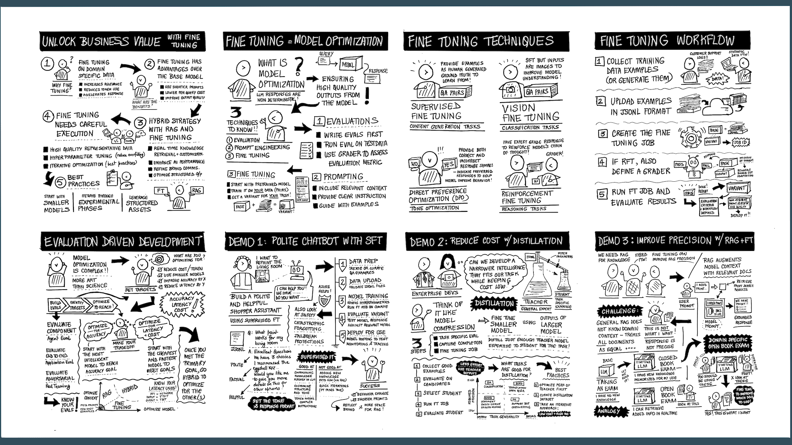

# Session Storyboard (Narrative)

The sketchnote provided below is embedded as the last slide of the deck along. _Encourage attendees to take a picture when you show that slide_ - it lets them take away both a visual recap and QR codes that point to a whitepaper (for decision-makers) and to this repo (for developers), to improve recall.

The storyboard itself serves as a conversational narrative that can give you some background context if you are new to this topic. You do not need to use this in your delivery, but we hope it gives you a sense for the key questions that developers have, and how we address them.

| Tile | Question | Description |
|:---|:---|:---|
| 1 | How do I unlock business value? | With fine-tuning you can customize models with task- or domain- specific data to improve model performance on your task!|
| 2 | How do I get started on customization?  | Start with a base model. Try prompt engineering and RAG to optimize model context. Then use fine-tuning to adapt behavior for improved cost, latency and accuracy! |
| 3 | What fine-tuning technique should I use? | It depends on the model, the task, and the target metric to optimize! Use SFT for content generation tasks, RFT for reasoning tasks, Vision Tuning for image classification or entity extraction tasks, and Distillation for model compression objectives. |
| 4 | What does a fine-tuning process involve? | It starts with dataset curation (in JSONL format). Upload the data, configure hyperparameters, and start the fine-tuning job. Once completed, evaluate the fine-tuned variant to assess if your performance targets have improved - else iterate. |
| 5 | What is evaluation-driven development? | It's like test-driven development but for AI applications. Start by defining evaluators to assess metrics, then set goals (pass/fail or other) before you begin optimization. Run evaluations on every iteration to verify improvements - till you meet your goals.|
| 6 | How can I customize model tone and style? | Start with a basic technique like Supervised Fine Tuning (SFT) where you train it on examples that _show_ (not tell) the desired behavior with Q&A pairs in JSONL format.|
| 7 | How can I reduce model operating costs? | If your target task can be achieved with _narrower intelligence_ then distillation helps! Use your current LLM as a "teacher" to train a smaller, cheaper model to do that one task well! |
| 8 | How can I improve precision for RAG?| Fine-tuning cannot _add_ data to the model, but it can _refine_ behaviors that work with that data. With techniques like RAFT, you can teach the model how to _select_ better context (given both relevant and distractor documents) - thereby improving _precision_ in responses. |
|  | | |

