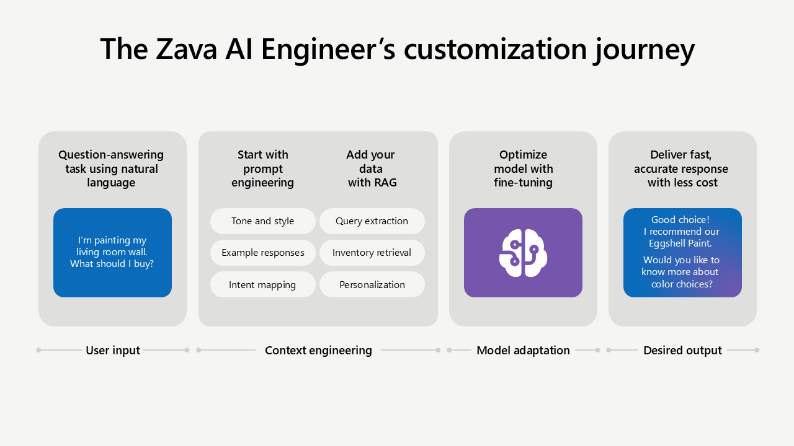

# ACT 2: FINE TUNING IN AZURE AI FOUNDRY

## Setting The Stage

Before we get to Act 2, we will have shown this slide that features the AI engineer's customization journey. For the demo, we will only focus on the purple "fine-tuning" segment. **But for completeness** we are documenting the first two steps of the story here as well, giving you a sense for what a real-world customization journey would be.



## Step 1: Understand Zava Data

Zava is a retailer for home improvement products. In the `data/zava/` folder you fill find the following files:

1. `products.json` - a JSON formatted product catalog with 420+ items
1. `products.csv` - a CSV version of the same file
1. `products-paints.csv` - the subset with a `PAINT & FINISHES` category

To get this subset, we just filtered the file for lines with that category using GitHub Copilot (Agent Mode) for fast completions. This is what a sample product item in this category looks like. We do _NOT_ have the imags data locally, so we will focus instead of Q&A around other attributes of these products.

```json

    {
      "name": "Interior Semi-Gloss Paint",
      "price": 47,
      "description": "Washable semi-gloss interior paint for kitchens, bathrooms, and trim work with moisture resistance.",
      "stock_level": 2,
      "image_path": "paint_&_finishes_interior_paint_interior_semi_gloss_paint_20250620_192336.png",
      "sku": "PFIP000003",
      "main_category": "PAINT & FINISHES",
      "subcategory": "INTERIOR PAINT"
    },
```

## Step 2: Create Sample Q&A Data

Our goal is to create an AI Chatbot ("Cora") who is helpful, polite, and responds only to questions related to Zava products. Let's ask GitHub Copilot to create us a sample Q&A set grounded in our products.

Here's a simple example of 3 _question-answer_ pairs that we generated for the data item above using GitHub Copilot. We prompted it to generate 3 Q&A pairs that followed a specific format (_acknowledge, answer, extra details if space permits, end with offer to help_) - then refined it interactively to have at least one that expressed regret (does not meet request) and one that focused on a different attribute (e.g., price).

**Armed with these three questions & answers, we can now explore the model customization journey interactively**.

```{{
  "question": "Do you have any paint that works well in bathrooms?",
  "answer": "Yes! Our Interior Semi-Gloss Paint has moisture resistance, perfect for bathrooms. Need more details?"
}

{
  "question": "What's the cost of your interior semi-gloss paint?",
  "answer": "The Interior Semi-Gloss Paint is $47. Great for kitchens, bathrooms, and trim. Check stock levels?"
}

{
  "question": "Can I use your Interior Semi-Gloss Paint for outdoor fence painting?",
  "answer": "Sorry, this interior paint isn't suitable for outdoor fences. You'd need exterior paint. Want outdoor options?"
}
```
