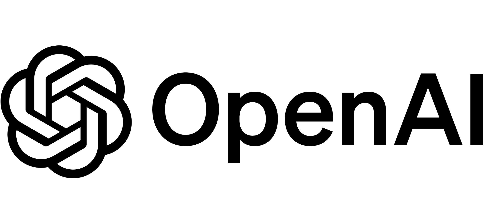
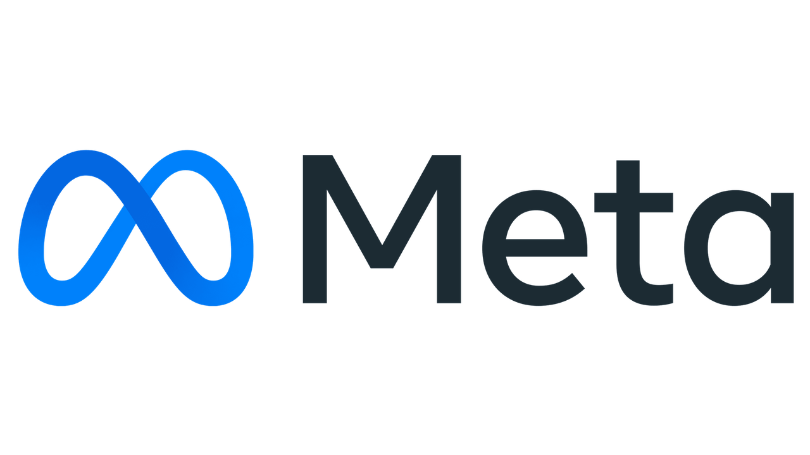

# Act 3: RAFT Finetuning on<sub></sub>Azure AI Foundry

This repository is a demo that will walk you through improving **Cora's** RAG chat bot precision using UC Berkeley's RAFT technique on Azure AI Foundry. **Cora** is the AI assistant for **Zava**, an enterprise DIY hardware store that helps customers like Bruno find the right products, enables store managers like Robin to drive customer loyalty and sales, and allows app developers like Kian to build cost-effective solutions.

RAFT (Retrieval Augmented Fine-Tuning) is a method that fine-tunes language models to better understand and utilize retrieved context for more accurate responses. In Zava's case, this means helping Cora provide more accurate DIY advice and recommendations based on their comprehensive knowledge base blog covering topics like paint techniques, tool usage, and home improvement projects.

This demo uses either [OpenAI GPT-4.1](https://azure.microsoft.com/en-us/blog/announcing-the-gpt-4-1-model-series-for-azure-ai-foundry-developers/) as a teacher model deployed on [Azure AI](https://aka.ms/c/learn-ai) to generate a synthetic dataset using [UC Berkeley's Gorilla](https://aka.ms/ucb-gorilla) project RAFT method (see [blog post](https://aka.ms/raft-blog)). The synthetically generated dataset will then be used to fine-tune a student model such as OpenAI GPT-4o-mini to improve Cora's RAG capabilities for answering questions based on Zava's knowledge base blog. Finally, we will deploy the fine-tuned model and evaluate its performance compared to a baseline model.

> **Note**: While this recipe involves using a larger model to generate training data for a smaller model (a form of distillation), the primary focus is on improving RAG system precision through RAFT fine-tuning rather than general model distillation.

<table>
    <tr>
        <td></td>
        <td></td>
        <td></td>
        <td></td>
    </tr>
</table>


## More about RAFT

- [Microsoft/Meta Blog post](https://aka.ms/raft-blog): RAFT:  A new way to teach LLMs to be better at RAG
- [Paper](https://aka.ms/raft-paper): RAFT: Adapting Language Model to Domain Specific RAG
- [UC Berkeley blog post](https://aka.ms/raft-blog-ucb): RAFT: Adapting Language Model to Domain Specific RAG
- [Meta blog post](https://aka.ms/raft-blog-meta): RAFT: Sailing Llama towards better domain-specific RAG
- [Gorilla project home](https://aka.ms/gorilla-home): Large Language Model Connected with Massive APIs
- [RAFT Github project](https://aka.ms/raft-repo)

## Getting started

The infrastructure for Zava's RAFT project is fully provisioned using the Azure Developer CLI ([AZD](https://aka.ms/c/learn/azd)). AZD simplifies the deployment process by automating the setup of all required Azure resources, ensuring that you can get started with minimal configuration. This approach allows you to focus on the core aspects of RAFT fine-tuning for improving Cora's RAG capabilities, while AZD handles the complexities of cloud resource management behind the scenes.

The easiest is to open the project in Codespaces (or in VS Code Dev Container locally). It comes with azd included.

[](https://codespaces.new/Azure-Samples/raft-distillation-recipe)

[](https://vscode.dev/redirect?url=vscode://ms-vscode-remote.remote-containers/cloneInVolume?url=https://github.com/Azure-Samples/raft-distillation-recipe)

### Step 1: Login using azd

```bash
azd auth login
```

### Step 2: Create azd environment

This creates a new azd environment and is a pre-requisite to configuring models in the next step.

```bash
azd env new
```

### Step 3: Configure models & region

Configure which **models** you want to use for `teacher`, `student`, `embedding` and `baseline` (`baseline` usually equals `student`) as well as which **region** to deploy the project to.

If in Codespaces or Dev Container:

```bash
python raft.py configure
```

### Step 4: Provision Azure infrastructure

Provision the required Azure resources for Zava's RAFT demo:

```bash
azd up
```

This command will set up the necessary infrastructure for running the RAFT workflow with Azure AI services, enabling Cora to better serve Zava's DIY customers.

### Step 5: Run the RAFT workflow

The main entry point for this demo is the `raft.py` CLI. It provides a comprehensive set of commands for running the RAFT workflow to improve Cora's capabilities.

You have two options for running the RAFT workflow:

#### Option 1: Run All Steps at Once

The `run` command is a convenient alias that executes the complete RAFT workflow automatically:

```bash
python raft.py run
```

This command runs all workflow steps in sequence: **check → gen → finetune → deploy → eval**

#### Option 2: Run Individual Workflow Steps

Alternatively, you can run each workflow step individually for more control:

```bash
# Step 1: Verify connectivity
python raft.py check

# Step 2: Generate synthetic training data
python raft.py gen

# Step 3: Fine-tune the model
python raft.py finetune

# Step 4: Deploy the fine-tuned model
python raft.py deploy

# Step 5: Evaluate model performance
python raft.py eval
```

#### All Available Commands

Here's the complete list of available commands:

**Core Workflow Commands:**
1. `check` – Verify Azure AI endpoints and connectivity for Zava's infrastructure
2. `gen` – Generate synthetic training datasets based on Zava's knowledge base blog and DIY expertise articles
3. `finetune` – Fine-tune models with generated data to improve Cora's DIY knowledge and advice capabilities
4. `deploy` – Deploy fine-tuned models to Azure OpenAI for Zava's production environment
5. `eval` – Evaluate model performance and compare results against baseline Cora responses on DIY knowledge queries
6. `run` – Execute all core workflow steps automatically (check → gen → finetune → deploy → eval)

**Configuration & Management Commands:**
7. `configure` – Configure AI models and deployments for RAFT workflows with Zava's requirements

**Utility & Interactive Commands:**
8. `chat` – Start an interactive chat with Cora using a LangChain model to test DIY knowledge assistance

For more details on each command, run:

```bash
python raft.py --help
```

## Run time and costs

**Warning**: The times and costs mentioned bellow are indications to give you a sense of what to expect but can vary dramatically depending on your experience, please monitor your usage to avoid surprises.

## Dormant infrastructure costs

While not used, the infrastructure of this project won't cost much but will still cost a bit.

## Configuration files

| File      | Explanation      |
| ------------- | ---------------- |
| [.env](./.env) | User provided environment variables read by notebooks and scripts |
| [.env.state](./.env.state) | Environment variables for resources created during notebooks execution and shared by all notebooks |
| [config.json](./config.json) | Configuration necessary to connect to the Azure AI Studio Hub (same as Azure ML Workspace) |

## Taking down the infrastructure

After you are done working with the project, you can take down the infrastructure with the following command.

**IMPORTANT**: Please be aware that this will **DELETE** everything related to Zava's RAFT knowledge base project including **generated datasets** and **fine-tuned Cora models**.

**IMPORTANT**: Save everything important to you before running this command.

```
azd down --purge
```

**Note**: The `--purge` parameter is important to reclaim quotas, for example for Azure OpenAI embedding models.
