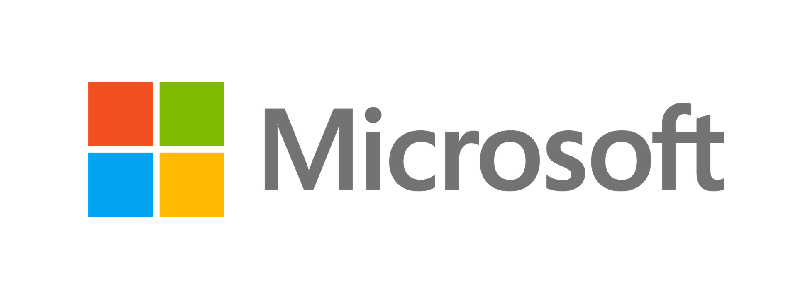

# RAFT Finetuning on<sub></sub>Azure AI Foundry

This repository is a recipe that will walk you through improving RAG system precision using UC Berkeley's RAFT technique on Azure AI Foundry. RAFT (Retrieval Augmented Fine-Tuning) is a method that fine-tunes language models to better understand and utilize retrieved context for more accurate responses.

This recipe uses either [OpenAI GPT-4o](https://learn.microsoft.com/en-us/azure/ai-services/openai/concepts/models?tabs=python-secure#gpt-4o-and-gpt-4-turbo) or [Meta Llama 3.1 405B](https://aka.ms/c/learn-deploy-llama) as a teacher model deployed on [Azure AI](https://aka.ms/c/learn-ai) to generate a synthetic dataset using [UC Berkeley's Gorilla](https://aka.ms/ucb-gorilla) project RAFT method (see [blog post](https://aka.ms/raft-blog)). The synthetically generated dataset will then be used to fine-tune a student model such as OpenAI GPT-4o-mini or Meta Llama 3.1 8B or another supported model to improve its RAG capabilities. Finally, we will deploy the fine-tuned model and evaluate its performance compared to a baseline model.

> **Note**: While this recipe involves using a larger model to generate training data for a smaller model (a form of distillation), the primary focus is on improving RAG system precision through RAFT fine-tuning rather than general model distillation.

The workflows and notebooks are designed to be as hands-free as possible, ensuring that even complex tasks like generating synthetic datasets, fine-tuning models, and deploying them can be accomplished with minimal manual intervention.

<table>
    <tr>
        <td></td>
        <td></td>
        <td></td>
        <td></td>
    </tr>
</table>


## More about RAFT

- [Microsoft/Meta Blog post](https://aka.ms/raft-blog): RAFT:  A new way to teach LLMs to be better at RAG
- [Paper](https://aka.ms/raft-paper): RAFT: Adapting Language Model to Domain Specific RAG
- [UC Berkeley blog post](https://aka.ms/raft-blog-ucb): RAFT: Adapting Language Model to Domain Specific RAG
- [Meta blog post](https://aka.ms/raft-blog-meta): RAFT: Sailing Llama towards better domain-specific RAG
- [Gorilla project home](https://aka.ms/gorilla-home): Large Language Model Connected with Massive APIs
- [RAFT Github project](https://aka.ms/raft-repo)

## Getting started / Provisioning Azure AI infrastructure

The infrastructure for this project is fully provisioned using the Azure Developer CLI ([AZD](https://aka.ms/c/learn/azd)). AZD simplifies the deployment process by automating the setup of all required Azure resources, ensuring that you can get started with minimal configuration. This approach allows you to focus on the core aspects of RAFT fine-tuning for RAG improvement, while AZD handles the complexities of cloud resource management behind the scenes. By leveraging AZD, the project maintains a consistent and reproducible environment, making it easier to collaborate and scale.

The easiest is to open the project in Codespaces (or in VS Code Dev Container locally). It comes with azd included.

[](https://codespaces.new/Azure-Samples/raft-distillation-recipe)

[](https://vscode.dev/redirect?url=vscode://ms-vscode-remote.remote-containers/cloneInVolume?url=https://github.com/Azure-Samples/raft-distillation-recipe)

### Login using azd

```
azd auth login --use-device-code
```

### Create azd environment

This creates a new azd environment and is a pre-requisite to configuring models in the next step.

```
azd env new
```

### Configure models & region

Configure which **models** you want to use for `teacher`, `student`, `embedding` and `baseline` (`baseline` usually equals `student`) as well as which **region** to deploy the project to.

> **Note**: Both OpenAI models and Azure Marketplace models are supported.


If in Codespaces or Dev Container:

```bash
python raft.py configure
```


# RAFT Demo – AI Tour 2026

This folder contains a demonstration of the RAFT (Retrieval Augmented Fine Tuning) methodology, presented at Microsoft AI Tour 2026.

## What is RAFT?

RAFT is a toolkit for efficient model customization using Azure AI services. It enables:
- Generation of synthetic datasets
- Fine-tuning of models
- Deployment and evaluation of model performance

The RAFT workflow is designed to streamline the process of adapting large language models to specific tasks using retrieval-augmented data and Azure infrastructure.

## RAFT CLI Overview (`raft.py`)

The main entry point for this demo is the `raft.py` CLI. It provides a comprehensive set of commands for running the RAFT workflow:

### Quick Start

Run the complete workflow in one command:

```bash
python raft.py run
```

### Step-by-Step Workflow

1. `configure` – Configure AI models and deployments for RAFT workflows
2. `check` – Verify Azure AI endpoints and connectivity
3. `gen` – Generate synthetic training datasets
4. `finetune` – Fine-tune models with generated data
5. `deploy` – Deploy fine-tuned models to Azure OpenAI
6. `eval` – Evaluate model performance and compare results
7. `status` – Monitor progress and results
8. `clean` – Clean up generated datasets and temporary files

### Utility & Interactive Commands

- `chat` – Start an interactive chat using a LangChain model

For more details on each command, run:

```bash
python raft.py --help
```

## RAFT Process Diagram


## Azure Deployment

To provision the required Azure resources for this demo, use the Azure Developer CLI:

```bash
azd up
```

This command will set up the necessary infrastructure for running the RAFT workflow with Azure AI services.

## License

See [LICENSE.md](LICENSE.md).
</details>

<details>
<summary>Azure OpenAI API</summary>

| Env var name                         | Explanation  |
| ------------------------------------ | -----  |
| `COMPLETION_AZURE_OPENAI_API_KEY`    | API Key for the teacher model  |
| `COMPLETION_AZURE_OPENAI_ENDPOINT`   | Endpoint for the teacher model  |
| `COMPLETION_AZURE_OPENAI_DEPLOYMENT` | Deployment name for the teacher model  |
| `COMPLETION_OPENAI_API_VERSION`      | API Version for the teacher model  |
| `EMBEDDING_AZURE_OPENAI_API_KEY`     | API Key for the embedding model  |
| `EMBEDDING_AZURE_OPENAI_ENDPOINT`    | Endpoint for the embedding model  |
| `EMBEDDING_AZURE_OPENAI_DEPLOYMENT`  | Deployment name for the embedding model  |
| `EMBEDDING_OPENAI_API_VERSION`       | API Version for the embedding model  |
| `BASELINE_AZURE_OPENAI_API_KEY`      | API Key for the baseline model  |
| `BASELINE_AZURE_OPENAI_ENDPOINT`     | Endpoint for the baseline model  |
| `BASELINE_AZURE_OPENAI_DEPLOYMENT`   | Deployment name for the baseline model  |
| `BASELINE_OPENAI_API_VERSION`        | API Version for the baseline model  |
| `JUDGE_AZURE_OPENAI_API_KEY`      | API Key for the judge model  |
| `JUDGE_AZURE_OPENAI_ENDPOINT`     | Endpoint for the judge model  |
| `JUDGE_AZURE_OPENAI_DEPLOYMENT`   | Deployment name for the judge model  |
| `JUDGE_OPENAI_API_VERSION`        | API Version for the judge model  |

</details>

</details>

## Notebooks

This repository is organized in 2 generic notebooks + 2 OpenAI specific notebooks + Azure MaaS (Model As A Service) specific notebooks, one for each step of the process:

| Notebook      | Azure OpenAI | Azure MaaS | Explanation      |
| ------------- | ---------------- | ---------------- | ---------------- |
| [1_gen.ipynb](./1_gen.ipynb) | ✔️ | ✔️ | Generate a finetuning dataset using RAFT |
| [2_finetune.ipynb](./2_finetune.ipynb) | | ✔️ | Fine tune a base model using the generated dataset |
| [2_finetune_oai.ipynb](./2_finetune.ipynb) | ✔️ | | Fine tune a base model using the generated dataset |
| [3_deploy.ipynb](./3_deploy.ipynb) | | ✔️ | Deploy the fine tuned model |
| [3_deploy_oai.ipynb](./3_deploy.ipynb) | ✔️ | | Deploy the fine tuned model |
| [4_eval.ipynb](./4_eval.ipynb) | ✔️ | ✔️ | Evaluate the fine tuned model |

## Run time and costs

**Warning**: The times and costs mentioned bellow are indications to give you a sense of what to expect but can vary dramatically depending on your experience, please monitor your usage to avoid surprises.

| Notebook      | Run time      | Cost      |
| ------------- | ---------------- | ---------------- |
| [1_gen.ipynb](./1_gen.ipynb) | From 5 minutes for the sample to multiple days for bigger domains | From $1 for the sample to $50 or more for bigger domains  |
| [2_finetune[_oai].ipynb](./2_finetune.ipynb) | Roughly 1.5 hours | Roughly $50 |
| [3_deploy[_oai].ipynb](./3_deploy.ipynb) | < 10 minutes | < $1 |
| [4_eval.ipynb](./4_eval.ipynb) | From 5 minutes for the sample to multiple days for bigger domains | From $1 for the sample to $50 or more for bigger domains |

## Dormant infrastructure costs

While not used, the infrastructure of this project won't cost much but will still cost a bit.

**TODO**: provide costs estimations for dormant infra

## Configuration files

| File      | Explanation      |
| ------------- | ---------------- |
| [.env](./.env) | User provided environment variables read by notebooks and scripts |
| [.env.state](./.env.state) | Environment variables for resources created during notebooks execution and shared by all notebooks |
| [config.json](./config.json) | Configuration necessary to connect to the Azure AI Studio Hub (same as Azure ML Workspace) |

## Parameterized execution

In addition to executing notebooks interactively, the notebooks also support parameterized command line execution using [papermill](https://papermill.readthedocs.io/).

### Parameter files

The parameter files are contained in folder [parameters](./parameters/) and support the following configurations:

| Parameter file     | Model      | Format      |
| ------------- | ---------------- | ---------------- |
| [Llama-2-7b.yaml](./parameters/Llama-2-7b.yaml)   | Llama-2-7b | Completion |
| [Meta-Llama-3-8B-Instruct.yaml](./parameters/Meta-Llama-3-8B-Instruct.yaml)   | Meta-Llama-3-8B-Instruct | Chat |
| [Meta-Llama-3.1-8B-Instruct.yaml](./parameters/Meta-Llama-3.1-8B-Instruct.yaml)   | Meta-Llama-3.1-8B-Instruct | Chat |

### Running notebooks from the command line with a parameter file

Notebooks can be run all at once with a given parameter file using the following command:

```
./run_all.sh -p ./parameters/Meta-Llama-3.1-8B-Instruct.yaml
```

## Taking down the infrastructure

After you are done working with the project, you can take down the infrastructure with the following command.

**IMPORTANT**: Please be aware that this will **DELETE** everything related to this project including **generated datasets** and **fine-tuned models**.

**IMPORTANT**: Save everything important to you before running this command.

```
azd down --purge
```

**Note**: The `--purge` parameter is important to reclaim quotas, for example for Azure OpenAI embedding models.
